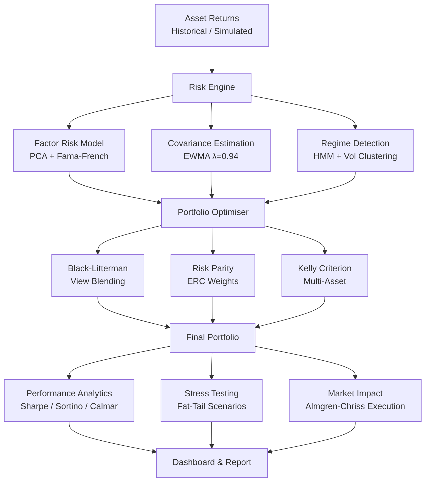
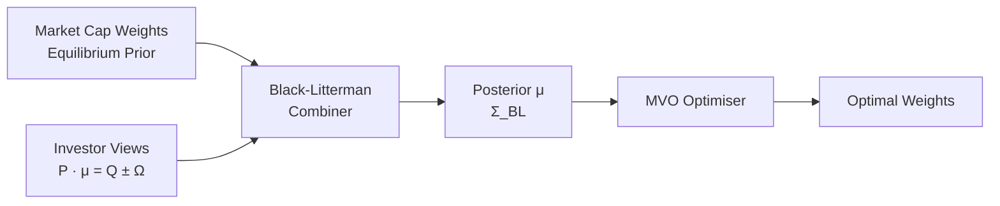

# Portfolio Risk Engine

A production-grade portfolio risk management system built in pure Python. Measures risk across multiple dimensions — VaR, CVaR, factor exposures, drawdown, and market microstructure impact — and optimises portfolio weights using Black-Litterman, Kelly criterion, and risk parity. Includes a full market microstructure layer for modelling the cost of actually trading the portfolio.

No external dependencies. Pure Python 3.8+ standard library only.

---

## How It Works



---

## Live Dashboard Output

```
┌─────────────────────────────────────────────────────────────────┐
│              PORTFOLIO PERFORMANCE DASHBOARD                     │
├─────────────────────────────────────────────────────────────────┤
│   Cumulative Return :  +18.40%   Benchmark:  +12.31%            │
│   Annual Return     :   +6.14%   Alpha    :  +3.22%             │
│   Volatility        :   14.80%   Beta     :   0.724             │
│   Sharpe Ratio      :   +0.821   Sortino  :  +1.143             │
│   Max Drawdown      :   12.30%   Calmar   :  +0.499             │
│   Tracking Error    :    9.80%   Info Ratio: +0.329             │
│   VaR 95%  (daily)  :   0.0154   CVaR 95% :  0.0199            │
│   Win Rate          :    53.2%                                   │
├─────────────────────────────────────────────────────────────────┤
│   Underwater (drawdown):                                         │
│   ▁▁▂▂▁▁▁▂▃▃▂▁▁▁▂▃▄▃▂▁▁▁▂▁▁▁▁▂▃▂▁▁▁▁▁▁▁▁▁▁                      │
│   Rolling Sharpe (63d):                                          │
│   ▃▄▅▆▇█▇▆▅▄▃▃▄▅▆▇▆▅▄▅▆▇▇▆▅▄▄▅▆▇▆▅▄▃▄▅▆▅▄                       │
│   Range: [-0.82, +2.34]  Current: +1.21                         │
├─────────────────────────────────────────────────────────────────┤
│   PORTFOLIO WEIGHTS                                              │
│   US Equity    ████████████████████ 35.0%                        │
│   Intl Equity  ██████████████░░░░░░ 25.0%                        │
│   EM Equity    ████████░░░░░░░░░░░░ 15.0%                        │
│   Bonds        ███████████░░░░░░░░░ 20.0%                        │
│   Gold         ██░░░░░░░░░░░░░░░░░░  5.0%                        │
└─────────────────────────────────────────────────────────────────┘
```

---

## Risk Measurement

### Value at Risk & CVaR

Historical and parametric VaR with Student-t fat tails (Gaussian copula for multi-asset):

```
Risk-Return Ladder (daily returns, 3-year sample):

  Percentile  |  Daily Return
  ----------------------------
       0.1%   |     -3.24%   ← extreme tail
         1%   |     -2.36%
         5%   |     -1.69%   ← VaR 95%
        10%   |     -1.28%
        50%   |     -0.01%   ← median
        90%   |     +1.25%
        95%   |     +1.54%
        99%   |     +2.14%
```

### Regime-Conditional Performance

```
Low Vol Regime  (50% of time):  Ann Ret = +9.2%  Sharpe = +1.24
High Vol Regime (50% of time):  Ann Ret = -2.1%  Sharpe = -0.38
```

---

## Black-Litterman Allocation



Takes market equilibrium returns (reverse-optimised from market cap weights) and blends them with analyst views using the P/Q/Ω view matrix. The posterior mean and covariance feed directly into mean-variance optimisation.

---

## Market Microstructure Layer

The engine models the real cost of executing a portfolio change using Almgren-Chriss optimal execution:

```
Almgren-Chriss: Selling 100,000 shares over 10 periods
Permanent impact:  γ = 1e-7 per share
Temporary impact:  η = 1e-6 per share

Period  |  Shares Left  |  Shares Traded
---------------------------------------
     0  |    100,000    |     12,403
     2  |     77,090    |     11,026
     4  |     56,232    |      9,805
     6  |     37,180    |      8,718
     8  |     19,769    |      7,752
     9  |     11,882    |      7,887

Expected shortfall: $312.40
Std[shortfall]:     $480.20
```

---

## Running It

```bash
git clone https://github.com/Krish-1717/portfolio-risk-engine
cd portfolio-risk-engine

# Run the full risk report with ASCII dashboard
python quant_code/portfolio_day30_final_report.py

# Run Black-Litterman allocation
python quant_code/portfolio_day27_black_litterman.py

# Run market microstructure / execution analysis
python quant_code/microstructure_liquidity.py

# Run all modules
python run_demos.py
```

**Requirements:** Python 3.8+, no pip install needed.

---

## Project Structure

```
portfolio-risk-engine/
├── risk.py                                # Core VaR, CVaR, Monte Carlo
├── backtesting/                           # Event-driven backtester
├── optimization/                          # MVO, efficient frontier
├── factor_models/                         # Fama-French, factor signals
├── regimes/                               # HMM, vol-clustering regimes
├── execution/                             # TWAP/VWAP algorithms
├── microstructure/                        # Bid-ask, Kyle's lambda
├── fixed_income/                          # Duration, yield curve
├── reporting/                             # Tear sheet generation
└── quant_code/
    ├── portfolio_day20_pca_risk_model.py  # PCA factor decomposition
    ├── portfolio_day21_regime_optimizer.py # Regime-conditional MVO
    ├── portfolio_day22_risk_summary.py    # Full risk dashboard
    ├── portfolio_day23_dynamic_risk_parity.py # ERC cyclical descent
    ├── portfolio_day24_transaction_costs.py   # Impact-aware rebalancing
    ├── portfolio_day25_factor_models.py   # FF3, crowding, smart-beta
    ├── portfolio_day26_stress_testing.py  # Fat-tail MC, copula
    ├── portfolio_day27_black_litterman.py # BL view blending
    ├── portfolio_day28_dynamic_risk.py    # EWMA cov, Kelly sizing
    ├── portfolio_day29_factor_attribution.py # Barra + Brinson
    ├── portfolio_day30_final_report.py    # ASCII dashboard + report
    ├── microstructure_vpin.py             # VPIN, PIN, trade classification
    └── microstructure_liquidity.py        # Amihud, Roll, Almgren-Chriss
```
